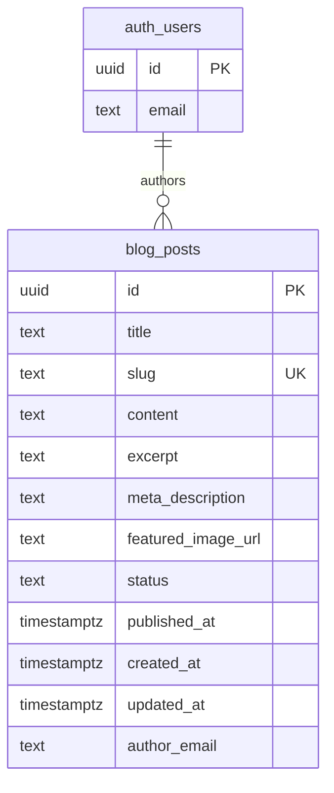

# Blog and Admin Section with Supabase Auth

## Overview

Build a public blog (`/blog`, `/blog/[slug]`) and a protected admin section (`/admin/blog`) for Cove Cutlery. Authentication is Supabase magic link, restricted to `elagerway@gmail.com`. The admin allows creating, editing, publishing, and deleting blog posts. The public blog shows published posts with SEO metadata and ISR.

---

## ERD



---

## Technical Approach

### Auth Stack
- `@supabase/ssr` (new install) — cookie-based session management for Next.js App Router
- Supabase magic link (OTP email) — no password, user receives a login link
- `src/middleware.ts` at project root — refreshes session on every request; redirects `/admin/**` to `/admin/login` if no authenticated user with the allowed email
- Auth callback at `src/app/auth/callback/route.ts` — exchanges PKCE code for session

### Data Layer
- Supabase `blog_posts` table (new)
- RLS: public can SELECT published posts; only `elagerway@gmail.com` can INSERT/UPDATE/DELETE
- API routes for admin CRUD — consistent with existing project pattern (`NextRequest`/`NextResponse`)
- Public blog pages use ISR (`export const revalidate = 300`)

### Key `@supabase/ssr` Patterns
- `cookies()` from `next/headers` is **async** in Next.js 16 — must be `await`ed
- Always use `getUser()` not `getSession()` server-side (getUser verifies with Supabase servers)
- Middleware must set cookies on **both** `request` and `supabaseResponse` (keeps client + server in sync)
- Never replace `supabaseResponse` with a new `NextResponse.next()` — session cookies will be lost
- `createBrowserClient` for `"use client"` components; `createServerClient` factory for everything else

---

## Implementation Phases

### Phase 1 — Foundation

#### 1.1 Install `@supabase/ssr`

```bash
npm install @supabase/ssr
```

#### 1.2 Supabase Migration — `blog_posts` table

Run via Supabase MCP (`mcp__supabase__apply_migration`):

```sql
-- Migration: create_blog_posts
CREATE TABLE blog_posts (
  id               UUID        DEFAULT gen_random_uuid() PRIMARY KEY,
  title            TEXT        NOT NULL,
  slug             TEXT        NOT NULL UNIQUE,
  content          TEXT,
  excerpt          TEXT,
  meta_description TEXT,
  featured_image_url TEXT,
  status           TEXT        DEFAULT 'draft'
                               CHECK (status IN ('draft', 'published')),
  published_at     TIMESTAMPTZ,
  created_at       TIMESTAMPTZ DEFAULT NOW(),
  updated_at       TIMESTAMPTZ DEFAULT NOW(),
  author_email     TEXT        NOT NULL
);

-- Trigger: auto-update updated_at
CREATE OR REPLACE FUNCTION update_updated_at()
RETURNS TRIGGER AS $$
BEGIN
  NEW.updated_at = NOW();
  RETURN NEW;
END;
$$ LANGUAGE plpgsql;

CREATE TRIGGER blog_posts_updated_at
  BEFORE UPDATE ON blog_posts
  FOR EACH ROW EXECUTE FUNCTION update_updated_at();

-- RLS
ALTER TABLE blog_posts ENABLE ROW LEVEL SECURITY;

-- Public read: only published posts
CREATE POLICY "Public read published posts"
  ON blog_posts FOR SELECT
  USING (status = 'published');

-- Admin write: only elagerway@gmail.com
CREATE POLICY "Admin insert"
  ON blog_posts FOR INSERT
  WITH CHECK ((auth.jwt() ->> 'email') = 'elagerway@gmail.com');

CREATE POLICY "Admin update"
  ON blog_posts FOR UPDATE
  USING ((auth.jwt() ->> 'email') = 'elagerway@gmail.com');

CREATE POLICY "Admin delete"
  ON blog_posts FOR DELETE
  USING ((auth.jwt() ->> 'email') = 'elagerway@gmail.com');

-- Admin select all (drafts + published) — service role bypass or auth check
CREATE POLICY "Admin read all"
  ON blog_posts FOR SELECT
  USING ((auth.jwt() ->> 'email') = 'elagerway@gmail.com');
```

> **Note on RLS SELECT conflict:** Two SELECT policies exist — Supabase uses OR logic, so an admin user will hit "Admin read all" and see drafts. Public users only see published.

#### 1.3 Supabase Auth — Enable Email Magic Link

In Supabase Dashboard → Authentication → Providers → Email:
- Enable "Email OTP" (magic link)
- Add `http://localhost:3002/auth/callback` to **Redirect URLs** (dev)
- Add `https://covecutlery.com/auth/callback` to **Redirect URLs** (prod)

#### 1.4 Supabase Client Factories

**`src/utils/supabase/server.ts`** — server components, route handlers, middleware:

```typescript
import { createServerClient } from '@supabase/ssr'
import { cookies } from 'next/headers'

export async function createClient() {
  const cookieStore = await cookies()

  return createServerClient(
    process.env.NEXT_PUBLIC_SUPABASE_URL!,
    process.env.NEXT_PUBLIC_SUPABASE_ANON_KEY!,
    {
      cookies: {
        getAll() {
          return cookieStore.getAll()
        },
        setAll(cookiesToSet) {
          try {
            cookiesToSet.forEach(({ name, value, options }) =>
              cookieStore.set(name, value, options)
            )
          } catch {
            // Server Components cannot write cookies — session refresh handled by middleware
          }
        },
      },
    }
  )
}
```

**`src/utils/supabase/client.ts`** — `"use client"` components only:

```typescript
'use client'
import { createBrowserClient } from '@supabase/ssr'

export function createClient() {
  return createBrowserClient(
    process.env.NEXT_PUBLIC_SUPABASE_URL!,
    process.env.NEXT_PUBLIC_SUPABASE_ANON_KEY!
  )
}
```

#### 1.5 Middleware — `src/middleware.ts`

Placed at project root (same level as `src/`):

```typescript
import { createServerClient } from '@supabase/ssr'
import { NextResponse, type NextRequest } from 'next/server'

const ADMIN_EMAIL = 'elagerway@gmail.com'

export async function middleware(request: NextRequest) {
  let supabaseResponse = NextResponse.next({ request })

  const supabase = createServerClient(
    process.env.NEXT_PUBLIC_SUPABASE_URL!,
    process.env.NEXT_PUBLIC_SUPABASE_ANON_KEY!,
    {
      cookies: {
        getAll() {
          return request.cookies.getAll()
        },
        setAll(cookiesToSet) {
          cookiesToSet.forEach(({ name, value }) =>
            request.cookies.set(name, value)
          )
          supabaseResponse = NextResponse.next({ request })
          cookiesToSet.forEach(({ name, value, options }) =>
            supabaseResponse.cookies.set(name, value, options)
          )
        },
      },
    }
  )

  // CRITICAL: Do not add code between createServerClient and getUser()
  const { data: { user } } = await supabase.auth.getUser()

  const isAdminRoute = request.nextUrl.pathname.startsWith('/admin')
  const isLoginPage = request.nextUrl.pathname === '/admin/login'

  if (isAdminRoute && !isLoginPage) {
    if (!user || user.email !== ADMIN_EMAIL) {
      const loginUrl = request.nextUrl.clone()
      loginUrl.pathname = '/admin/login'
      return NextResponse.redirect(loginUrl)
    }
  }

  // If logged-in admin visits /admin/login, redirect to /admin/blog
  if (isLoginPage && user?.email === ADMIN_EMAIL) {
    const blogUrl = request.nextUrl.clone()
    blogUrl.pathname = '/admin/blog'
    return NextResponse.redirect(blogUrl)
  }

  return supabaseResponse
}

export const config = {
  matcher: [
    '/((?!_next/static|_next/image|favicon.ico|icon.svg|.*\\.(?:svg|png|jpg|jpeg|gif|webp)$).*)',
  ],
}
```

---

### Phase 2 — Auth Pages

#### 2.1 Auth Callback — `src/app/auth/callback/route.ts`

```typescript
import { NextResponse } from 'next/server'
import { createClient } from '@/utils/supabase/server'

export async function GET(request: Request) {
  const { searchParams, origin } = new URL(request.url)
  const code = searchParams.get('code')
  let next = searchParams.get('next') ?? '/admin/blog'
  if (!next.startsWith('/')) next = '/admin/blog'

  if (code) {
    const supabase = await createClient()
    const { error } = await supabase.auth.exchangeCodeForSession(code)
    if (!error) {
      const forwardedHost = request.headers.get('x-forwarded-host')
      const base = forwardedHost
        ? `https://${forwardedHost}`
        : origin
      return NextResponse.redirect(`${base}${next}`)
    }
  }

  return NextResponse.redirect(`${origin}/admin/login?error=auth`)
}
```

#### 2.2 Login Page — `src/app/admin/login/page.tsx`

Client component. Calls `supabase.auth.signInWithOtp({ email })` and shows a "Check your email" confirmation. Matches dark site theme.

```typescript
'use client'
import { useState } from 'react'
import { createClient } from '@/utils/supabase/client'

export default function AdminLoginPage() {
  const [sent, setSent] = useState(false)
  const [loading, setLoading] = useState(false)
  const [error, setError] = useState<string | null>(null)

  async function handleSubmit(e: React.FormEvent<HTMLFormElement>) {
    e.preventDefault()
    setLoading(true)
    setError(null)
    const email = (e.currentTarget.elements.namedItem('email') as HTMLInputElement).value
    const supabase = createClient()
    const { error } = await supabase.auth.signInWithOtp({
      email,
      options: { emailRedirectTo: `${location.origin}/auth/callback?next=/admin/blog` },
    })
    if (error) setError(error.message)
    else setSent(true)
    setLoading(false)
  }

  // ... render login form with dark theme styling
}
```

---

### Phase 3 — Admin Blog CRUD

#### 3.1 Admin Layout — `src/app/admin/layout.tsx`

Server Component. Reads user from Supabase, renders sidebar nav with links to `/admin/blog` and a logout button. Dark theme (#0D1117 bg, #161B22 sidebar).

```typescript
// src/app/admin/layout.tsx
import { createClient } from '@/utils/supabase/server'
import { redirect } from 'next/navigation'
import AdminNav from '@/components/admin/AdminNav'

export default async function AdminLayout({ children }: { children: React.ReactNode }) {
  const supabase = await createClient()
  const { data: { user } } = await supabase.auth.getUser()

  if (!user || user.email !== 'elagerway@gmail.com') {
    redirect('/admin/login')
  }

  return (
    <div style={{ backgroundColor: '#0D1117', minHeight: '100vh', display: 'flex' }}>
      <AdminNav email={user.email} />
      <main style={{ flex: 1, padding: '2rem' }}>{children}</main>
    </div>
  )
}
```

#### 3.2 Admin Nav — `src/components/admin/AdminNav.tsx`

Client component (needs onClick for logout). Sidebar with: logo, "Blog Posts" link, "View Site" link, logout button.

#### 3.3 API Routes — `src/app/api/admin/posts/`

All routes verify the session and email before any DB operation.

**`src/app/api/admin/posts/route.ts`** — GET (list all) + POST (create):

```typescript
import { NextRequest, NextResponse } from 'next/server'
import { createClient } from '@/utils/supabase/server'

const ADMIN_EMAIL = 'elagerway@gmail.com'

async function requireAdmin() {
  const supabase = await createClient()
  const { data: { user } } = await supabase.auth.getUser()
  if (!user || user.email !== ADMIN_EMAIL) return null
  return supabase
}

export async function GET() {
  const supabase = await requireAdmin()
  if (!supabase) return NextResponse.json({ error: 'Unauthorized' }, { status: 401 })

  const { data, error } = await supabase
    .from('blog_posts')
    .select('id, title, slug, status, published_at, created_at')
    .order('created_at', { ascending: false })

  if (error) return NextResponse.json({ error: error.message }, { status: 500 })
  return NextResponse.json(data)
}

export async function POST(req: NextRequest) {
  const supabase = await requireAdmin()
  if (!supabase) return NextResponse.json({ error: 'Unauthorized' }, { status: 401 })

  const body = await req.json()
  const { title, slug, content, excerpt, meta_description, featured_image_url, status } = body

  if (!title || !slug) return NextResponse.json({ error: 'title and slug required' }, { status: 400 })

  const { data, error } = await supabase
    .from('blog_posts')
    .insert([{ title, slug, content, excerpt, meta_description, featured_image_url,
               status: status ?? 'draft', author_email: ADMIN_EMAIL,
               published_at: status === 'published' ? new Date().toISOString() : null }])
    .select()
    .single()

  if (error) return NextResponse.json({ error: error.message }, { status: 500 })
  return NextResponse.json(data, { status: 201 })
}
```

**`src/app/api/admin/posts/[id]/route.ts`** — GET + PUT + DELETE single post.

#### 3.4 Admin Blog List — `src/app/admin/blog/page.tsx`

Server Component. Fetches all posts via Supabase server client. Renders a table with columns: Title, Status (badge), Date, Actions (Edit | Publish/Unpublish | Delete).

#### 3.5 Post Form Component — `src/components/admin/PostForm.tsx`

Client component shared by create and edit pages. Fields:
- **Title** (text input, required) — onChange auto-generates slug
- **Slug** (text input, editable, unique)
- **Excerpt** (textarea, ~160 chars)
- **Meta Description** (textarea, ~160 chars)
- **Featured Image URL** (text input + preview)
- **Content** (large textarea, HTML stored as plain text for now)
- **Status** (select: draft / published)
- Submit button: "Save Draft" or "Publish"

#### 3.6 Create Post — `src/app/admin/blog/new/page.tsx`

Client component. Renders `<PostForm>`, on submit POSTs to `/api/admin/posts`, redirects to `/admin/blog` on success.

#### 3.7 Edit Post — `src/app/admin/blog/[id]/edit/page.tsx`

Server Component for data fetch, passes post to client `<PostForm>`. On submit PUTs to `/api/admin/posts/[id]`.

---

### Phase 4 — Public Blog

#### 4.1 Blog Index — `src/app/blog/page.tsx`

```typescript
export const revalidate = 300

import { createClient } from '@supabase/supabase-js'

export default async function BlogPage() {
  const supabase = createClient(
    process.env.NEXT_PUBLIC_SUPABASE_URL!,
    process.env.NEXT_PUBLIC_SUPABASE_ANON_KEY!
  )
  const { data: posts } = await supabase
    .from('blog_posts')
    .select('title, slug, excerpt, featured_image_url, published_at')
    .eq('status', 'published')
    .order('published_at', { ascending: false })

  // render post cards grid
}
```

No auth needed — anon key + RLS SELECT policy handles filtering to published-only.

#### 4.2 Blog Post — `src/app/blog/[slug]/page.tsx`

```typescript
export const revalidate = 300

export async function generateMetadata({ params }) {
  // fetch post by slug, return title + meta_description
}

export async function generateStaticParams() {
  // return all published slugs for static generation
}

export default async function BlogPostPage({ params }) {
  // fetch post, render content with dangerouslySetInnerHTML
  // include back link to /blog
}
```

#### 4.3 Blog Layout — `src/app/blog/layout.tsx`

Renders standard site `<Navbar>` and `<Footer>` — matches the rest of the site.

#### 4.4 Add Blog Link to Navbar

Add "Blog" link to `navLinks` array in `src/components/Navbar.tsx` pointing to `/blog`.

---

## New Environment Variables

No new secret env vars needed — `@supabase/ssr` reuses `NEXT_PUBLIC_SUPABASE_URL` and `NEXT_PUBLIC_SUPABASE_ANON_KEY`. The service role key is already present for server operations.

Update `docs/architecture.md` to document the auth flow and new routes.

---

## Acceptance Criteria

### Auth
- [ ] Visiting `/admin/blog` without a session redirects to `/admin/login`
- [ ] Only `elagerway@gmail.com` can complete login (any other email gets no access even with a valid session)
- [ ] Magic link email is sent successfully in both dev and prod
- [ ] Auth callback at `/auth/callback` exchanges code and redirects to `/admin/blog`
- [ ] Logout clears session and redirects to `/admin/login`

### Admin Blog
- [ ] List page shows all posts (draft + published) with status badges
- [ ] Can create a new post with title, slug, content, excerpt, meta, featured image, status
- [ ] Slug auto-generates from title (kebab-case), is editable
- [ ] Can edit any existing post
- [ ] Can delete a post (with confirmation)
- [ ] Publishing a post sets `published_at` to current timestamp
- [ ] Unpublishing a post sets status back to `draft`

### Public Blog
- [ ] `/blog` shows only published posts, ordered newest first
- [ ] `/blog/[slug]` renders full post with SEO metadata
- [ ] Draft posts are never visible to public (enforced by RLS, not just UI)
- [ ] Blog is linked from the site Navbar
- [ ] ISR revalidates every 5 minutes

---

## Dependencies & Risks

| Risk | Mitigation |
|---|---|
| `@supabase/ssr` API changes from training data | Confirmed patterns from Next.js 16 docs and Supabase SSR docs in research |
| RLS SELECT policy conflict (public + admin) | Supabase uses OR — both policies can coexist |
| Supabase auth redirect URLs not configured | Must add callback URLs in Supabase dashboard before testing magic link |
| `dangerouslySetInnerHTML` XSS for blog content | Content only comes from admin (trusted), no user-generated HTML |
| Middleware matcher too broad — slows static assets | Matcher pattern explicitly excludes static files and images |

---

## Files Summary

### New Files
| File | Type | Purpose |
|---|---|---|
| `src/middleware.ts` | Server | Session refresh + admin route protection |
| `src/utils/supabase/server.ts` | Lib | `createServerClient` factory |
| `src/utils/supabase/client.ts` | Lib | `createBrowserClient` factory |
| `src/app/auth/callback/route.ts` | Route Handler | PKCE code exchange |
| `src/app/admin/layout.tsx` | Layout | Admin shell (auth check + nav) |
| `src/app/admin/login/page.tsx` | Page | Magic link login form |
| `src/app/admin/blog/page.tsx` | Page | Post list |
| `src/app/admin/blog/new/page.tsx` | Page | Create post |
| `src/app/admin/blog/[id]/edit/page.tsx` | Page | Edit post |
| `src/components/admin/AdminNav.tsx` | Component | Admin sidebar nav + logout |
| `src/components/admin/PostForm.tsx` | Component | Shared create/edit form |
| `src/app/api/admin/posts/route.ts` | API Route | List + create posts |
| `src/app/api/admin/posts/[id]/route.ts` | API Route | Get + update + delete post |
| `src/app/blog/layout.tsx` | Layout | Blog shell (Navbar + Footer) |
| `src/app/blog/page.tsx` | Page | Public post list |
| `src/app/blog/[slug]/page.tsx` | Page | Public post detail |

### Modified Files
| File | Change |
|---|---|
| `src/components/Navbar.tsx` | Add "Blog" nav link |
| `docs/architecture.md` | Document auth flow, new routes, new env vars |
| `docs/changelog.md` | Add 1.3.0 entry |

---

## References

- `src/app/api/contact/route.ts` — existing API route pattern to follow
- `src/app/layout.tsx` — root layout pattern (BookingProvider wraps children)
- `node_modules/next/dist/docs/01-app/02-guides/authentication.md` — Next.js 16 auth guide
- `node_modules/next/dist/docs/01-app/03-api-reference/04-functions/cookies.md` — `cookies()` is async
- Supabase SSR: install `@supabase/ssr`, use `createServerClient` with `getAll`/`setAll` cookie handlers
